<div align="center">

# Manara Project

### AWS Cloud-Native CI/CD — Containerized Tasks API

A FastAPI application built, containerized, and deployed on AWS using a fully automated CI/CD pipeline, with infrastructure defined as code.


</div>

---

## Table of Contents

- [Overview](#overview)
- [Architecture](#architecture)
- [Tech Stack](#tech-stack)
- [Repository Structure](#repository-structure)
- [CI/CD Workflow](#cicd-workflow)
- [Infrastructure as Code](#infrastructure-as-code)
- [Networking and Security](#networking-and-security)
- [API Reference](#api-reference)
- [Configuration](#configuration)
- [Deployment](#deployment)
- [Screenshots](#screenshots)
- [Observability](#observability)
- [Cost Considerations](#cost-considerations)
- [Known Limitations and Roadmap](#known-limitations-and-roadmap)
- [Cleanup](#cleanup)
- [Author](#author)

---

## Overview

**Manara Project** is a containerized REST API (FastAPI) deployed on **Amazon ECS Fargate** behind an **Application Load Balancer**. Container images are built by **AWS CodeBuild**, stored in **Amazon ECR**, and orchestrated through **AWS CodePipeline** connected to GitHub.

The project demonstrates practical cloud and DevOps skills:

- Containerization with Docker
- AWS-native CI/CD (CodePipeline and CodeBuild)
- Serverless container hosting with ECS Fargate
- Infrastructure as Code with CloudFormation
- Load balancing and health checks
- Relational persistence with Amazon RDS (PostgreSQL)
- Secret management with AWS Secrets Manager
- Application logging to CloudWatch Logs and Amazon S3
- VPC design, security groups, and IAM roles

---

## Architecture


```text
Developer
   │
   ▼
GitHub Repository
   │
   ▼
AWS CodePipeline
   │
   ▼
AWS CodeBuild ──► Build Docker image ──► Push to Amazon ECR
                                              │
                                              ▼
                                     Amazon ECS Fargate
                                              │
                                              ▼
                                 Application Load Balancer
                                              │
                                              ▼
                                       FastAPI Service
                                              │
                    ┌─────────────┬───────────┴──────────┬──────────────┐
                    ▼             ▼                      ▼              ▼
             RDS PostgreSQL  CloudWatch Logs      Amazon S3      Secrets Manager
             (private)       (container logs)   (log archive)    (DB credentials)
```

### Network Layout

| Layer | Resources |
|-------|-----------|
| Public subnets | Application Load Balancer, ECS Fargate tasks |
| Private subnets | Amazon RDS PostgreSQL |
| VPC Endpoint | S3 Gateway Endpoint (private S3 access, no NAT Gateway) |

> ECS tasks run in public subnets in this training design to avoid NAT Gateway costs. Production workloads should use private subnets with VPC endpoints.

---

## Tech Stack

| Category | Technology |
|----------|------------|
| Application | Python, FastAPI, SQLAlchemy |
| Container | Docker |
| Compute | Amazon ECS on AWS Fargate |
| Registry | Amazon ECR |
| Load Balancing | Application Load Balancer |
| Database | Amazon RDS for PostgreSQL |
| CI/CD | GitHub, AWS CodePipeline, AWS CodeBuild |
| IaC | AWS CloudFormation |
| Secrets | AWS Secrets Manager |
| Logging | Amazon CloudWatch Logs, Amazon S3 |
| Networking | Amazon VPC, Security Groups, S3 Gateway Endpoint |
| Access Control | AWS IAM |

---

## Repository Structure

```text
manara-project/
├── app/
│   ├── main.py               # API routes and application entry point
│   ├── db.py                 # Database connection and models
│   ├── s3_logger.py          # Log handler that uploads logs to S3
│   ├── requirements.txt      # Python dependencies
│   └── Dockerfile            # Container image definition
│
├── infra/
│   ├── 01-network.yaml       # VPC, subnets, routing, endpoints, security groups
│   ├── 02-storage-db.yaml    # S3 log bucket, RDS PostgreSQL, DB secret
│   ├── 03-ecr-ecs-alb.yaml   # ECR, ECS cluster/service, ALB, IAM roles
│   └── 04-pipeline.yaml      # CodePipeline, CodeBuild, artifact bucket
│
├── scripts/
│   └── deploy.sh             # Ordered stack deployment helper
│
├── screenshots/              # Documentation images
├── buildspec.yml             # CodeBuild build instructions
├── solution architecture diagram.jpeg
├── .gitignore
└── README.md
```

---

## CI/CD Workflow

A push to the `main` branch triggers the pipeline:

1. **Source:** CodePipeline retrieves the commit from GitHub through a CodeConnections integration.
2. **Build:** CodeBuild executes `buildspec.yml`:
   - Authenticates with Amazon ECR
   - Builds the Docker image from `app/Dockerfile`
   - Pushes the image to the `manara/task-api` repository
   - Generates `imagedefinitions.json`
3. **Deploy:** ECS pulls the image from ECR and runs it as a Fargate task behind the ALB. ALB health checks determine whether the task receives traffic.

> **Current state:** the pipeline implements the Source and Build stages. The ECS deployment step is performed by updating the ECS service. Adding an automated ECS Deploy stage is on the roadmap.

---

## Infrastructure as Code

The infrastructure is split into four CloudFormation stacks, deployed in dependency order:

| Stack | Responsibility |
|-------|----------------|
| `01-network.yaml` | VPC, public and private subnets, Internet Gateway, route tables, S3 Gateway Endpoint, security groups |
| `02-storage-db.yaml` | S3 log bucket, RDS subnet group, RDS PostgreSQL instance, managed database secret |
| `03-ecr-ecs-alb.yaml` | ECR repository, ECS cluster and service, task definition, ALB, target group, listener, IAM roles, CloudWatch log group |
| `04-pipeline.yaml` | Artifact bucket, CodeBuild project, CodePipeline, IAM roles |

Splitting the stacks lets each layer be updated independently and shares values through CloudFormation exports.

---

## Networking and Security

```text
Internet ──► ALB (80) ──► ECS Fargate (app port) ──► RDS PostgreSQL (5432, private)
```

**Security group rules**

| Source | Destination | Port | Purpose |
|--------|-------------|------|---------|
| Internet | ALB | 80 | Public HTTP traffic |
| ALB security group | ECS security group | Application port | Forward requests to the API |
| ECS security group | RDS security group | 5432 | Database connections |

**Security principles**

- RDS is not publicly accessible and only accepts traffic from the ECS security group.
- Database credentials are stored in AWS Secrets Manager and injected at runtime.
- IAM roles grant AWS access to services; no access keys are stored in code or images.
- No secrets are committed to the repository.

---

## API Reference

Interactive documentation is available at `/docs` (Swagger UI).

| Method | Endpoint | Description |
|--------|----------|-------------|
| `GET` | `/` | Basic application message |
| `GET` | `/health` | Liveness check (used by the ALB) |
| `GET` | `/health/db` | Database connectivity check |
| `GET` | `/tasks` | List all tasks |
| `POST` | `/tasks` | Create a task |
| `PUT` | `/tasks/{task_id}/done` | Mark a task as completed |

**Create a task**

```bash
curl -X POST "http://<ALB-DNS-NAME>/tasks" \
  -H "Content-Type: application/json" \
  -d '{"title": "Complete AWS deployment"}'
```

**List tasks**

```bash
curl "http://<ALB-DNS-NAME>/tasks"
```

---

## Configuration

The application reads its configuration from environment variables:

| Variable | Description | Source |
|----------|-------------|--------|
| `DB_HOST` | RDS endpoint | ECS task definition |
| `DB_PORT` | Database port (default `5432`) | ECS task definition |
| `DB_NAME` | Database name | ECS task definition |
| `DB_USER` | Database username | ECS task definition |
| `DB_PASSWORD` | Database password | AWS Secrets Manager |
| `LOG_BUCKET` | S3 bucket for log files | ECS task definition |
| `AWS_DEFAULT_REGION` | AWS region | ECS task definition |

Sensitive values such as `DB_PASSWORD` must be injected through Secrets Manager and never committed to Git.

---

## Deployment

Deploy in dependency order:

```bash
# 1. Network
aws cloudformation deploy --template-file infra/01-network.yaml \
  --stack-name manara-network --capabilities CAPABILITY_NAMED_IAM

# 2. Storage and database
aws cloudformation deploy --template-file infra/02-storage-db.yaml \
  --stack-name manara-storage-db --capabilities CAPABILITY_NAMED_IAM

# 3. ECR, ECS, and ALB
aws cloudformation deploy --template-file infra/03-ecr-ecs-alb.yaml \
  --stack-name manara-app --capabilities CAPABILITY_NAMED_IAM

# 4. CI/CD pipeline
aws cloudformation deploy --template-file infra/04-pipeline.yaml \
  --stack-name manara-pipeline --capabilities CAPABILITY_NAMED_IAM
```

Or use the helper script:

```bash
./scripts/deploy.sh
```

After deployment:

1. Push a commit to `main` to trigger the pipeline.
2. Confirm the ECS service reaches a steady state.
3. Confirm the ALB target group reports a healthy target.
4. Open `http://<ALB-DNS-NAME>/docs` to test the API.

> Review parameters, IAM permissions, and expected costs before deploying to a live AWS account.

---

## Screenshots

### Application

**Swagger UI:** interactive API documentation served through the load balancer.

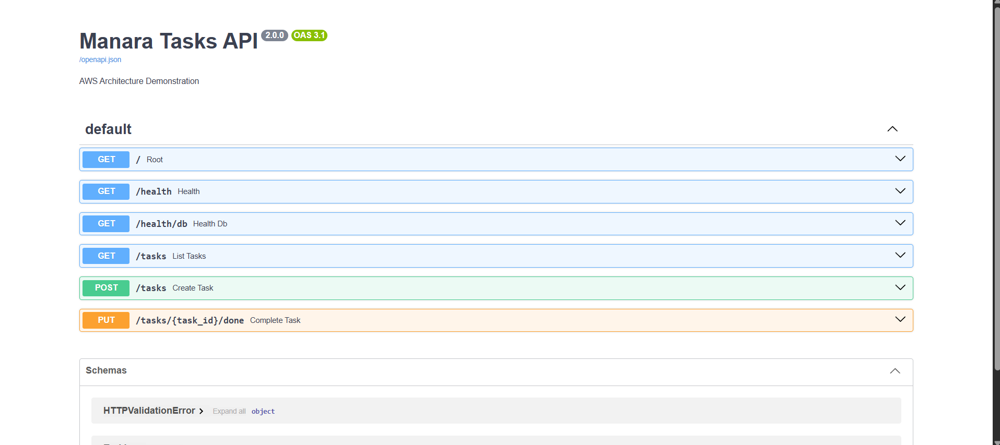

### Load Balancing

**Application Load Balancer:** internet-facing ALB spanning two Availability Zones.

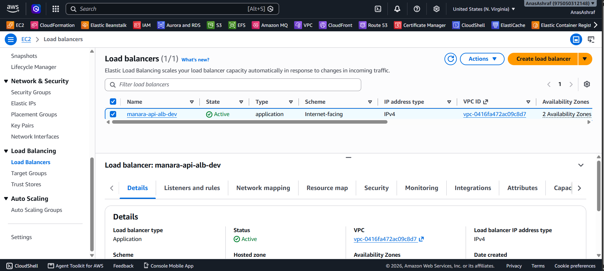

**Target Group:** routes traffic to ECS tasks by IP.

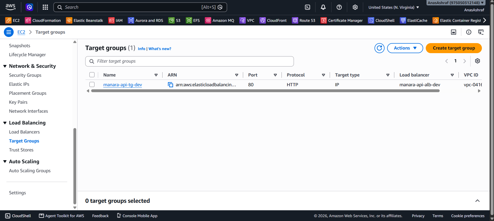

### Networking

**VPC:** dedicated VPC (`10.0.0.0/16`) hosting all resources.

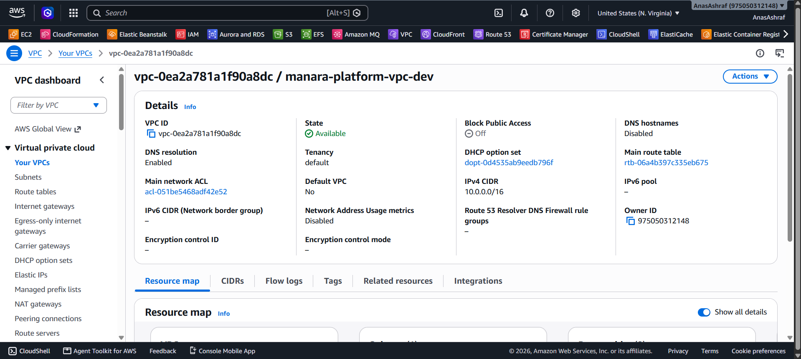

### Compute (ECS Fargate)

**Cluster tasks:** Fargate task running in the cluster.

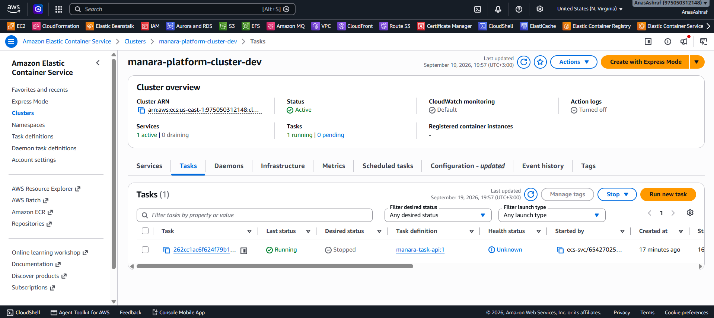

**Service:** ECS service with the desired task count.

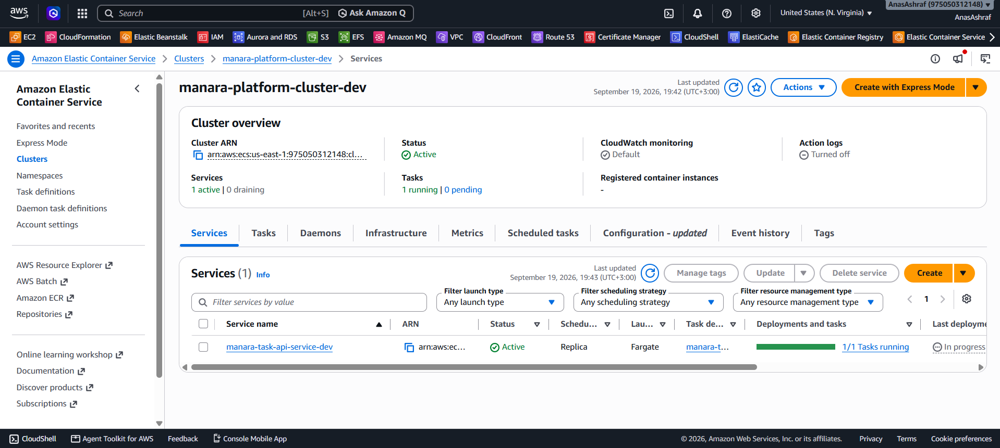

**Task definition:** 0.25 vCPU, 512 MiB memory, `awsvpc` network mode.

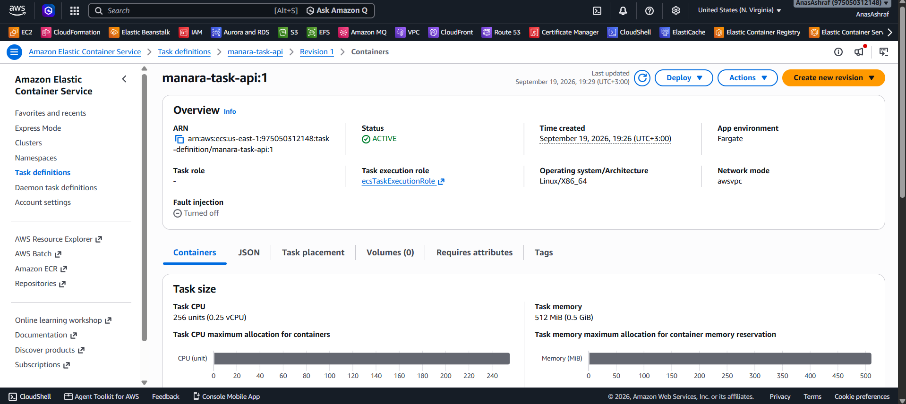

### Container Registry

**Repository:** ECR repository `manara/task-api`.

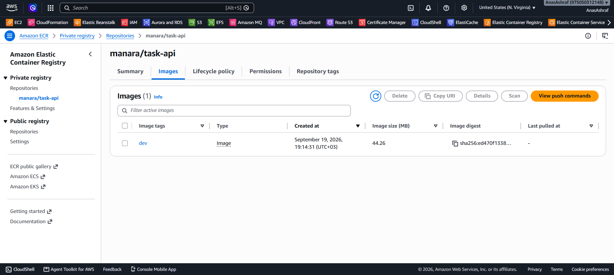

**Image details:** image pushed by the build process.

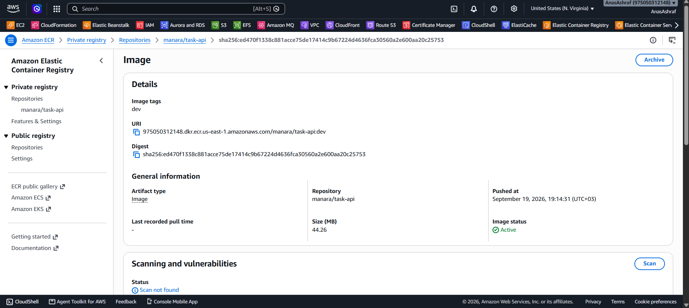

### CI/CD

**Pipeline:** Source and Build stages completed successfully.

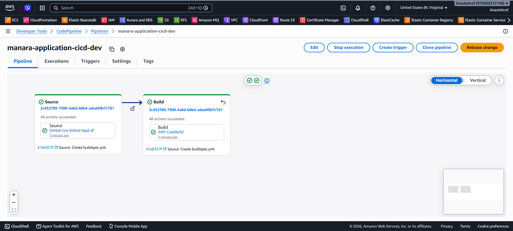

**Build:** CodeBuild project with a successful build.

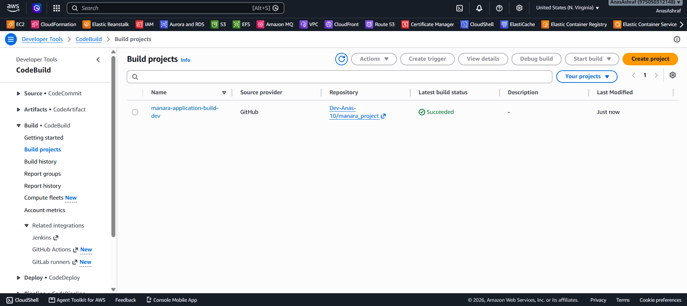

**Source repository:** project structure on GitHub.

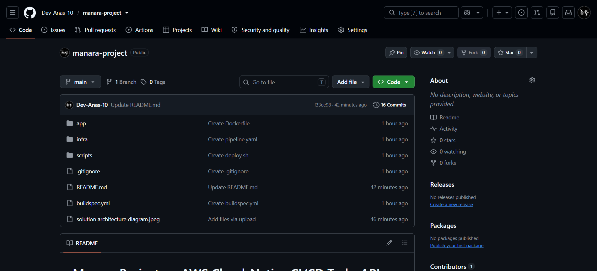

---

## Observability

| Path | Purpose |
|------|---------|
| **CloudWatch Logs** | Container stdout/stderr through the `awslogs` driver, used for troubleshooting and deployment investigation |
| **Amazon S3** | Buffered application log files for archival and later analysis |

The S3 logging implementation is intended for learning and demonstration. Production systems should consider managed log-delivery pipelines and lifecycle policies.

---

## Cost Considerations

Main cost drivers: Application Load Balancer, RDS, ECS Fargate runtime, CodeBuild minutes, S3, CloudWatch Logs, and ECR storage.

Cost-control decisions in this project:

- No NAT Gateway (S3 Gateway Endpoint instead)
- Small instance sizes (0.25 vCPU / 512 MiB tasks, micro database)
- Single-AZ database and a single ECS task
- ECR lifecycle policies and CloudWatch log retention limits

Delete resources when they are not in use. Check current AWS pricing for your region.

---

## Known Limitations and Roadmap

**Current limitations**

- The pipeline covers Source and Build; ECS deployment is not yet an automated pipeline stage.
- The task definition has no dedicated task role, so S3 log uploads need one to be granted.
- ECS tasks run in public subnets (training configuration).
- HTTP only, no TLS.
- Image tagging uses an environment tag (`dev`) rather than commit-based tags.

**Roadmap**

- [ ] Add an ECS Deploy stage to CodePipeline
- [ ] Attach a task role with least-privilege S3 access
- [ ] Commit-hash image tagging for traceability
- [ ] HTTPS with AWS Certificate Manager and HTTP-to-HTTPS redirect
- [ ] Move ECS tasks to private subnets with VPC endpoints
- [ ] Automated tests and security scanning in CodeBuild
- [ ] Database migrations with Alembic
- [ ] Auto scaling and CloudWatch alarms
- [ ] Multi-AZ database for production
- [ ] API authentication (Amazon Cognito)

---

## Cleanup

Delete stacks in reverse dependency order to avoid ongoing charges:

```bash
aws cloudformation delete-stack --stack-name manara-pipeline
aws cloudformation delete-stack --stack-name manara-app
aws cloudformation delete-stack --stack-name manara-storage-db
aws cloudformation delete-stack --stack-name manara-network
```

Empty the S3 buckets first if CloudFormation cannot delete them, and delete the ECR images if needed. RDS and S3 data cannot be recovered after deletion, so verify backups first.

---

## Author

**Anas**

- GitHub: [@Dev-Anas-10](https://github.com/Dev-Anas-10)
- Repository: [manara-project](https://github.com/Dev-Anas-10/manara-project)

---

<div align="center">

Built for learning and portfolio purposes.

</div>
